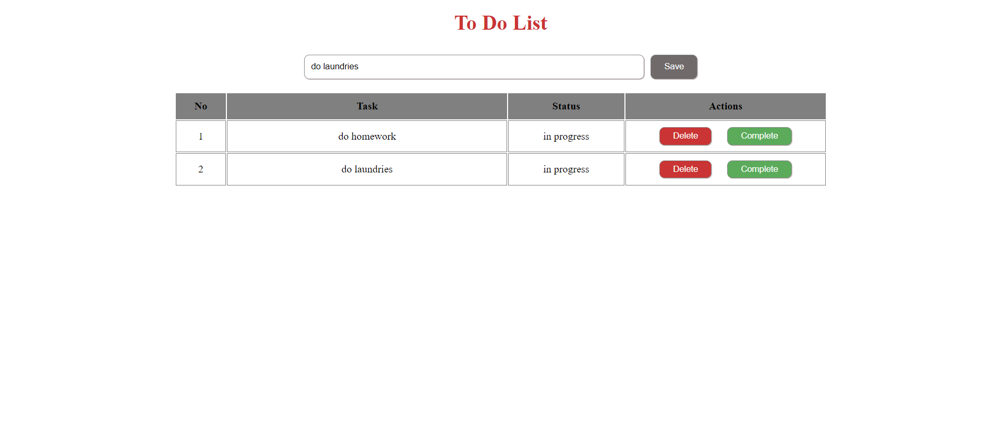

# To Do List Uygulaması

Bu uygulama, basit bir görev listesi tutma işlevi sağlar. Kullanıcılar, yapılacak görevleri ekleyebilir, işaretleyebilir veya silebilirler.



## Nasıl Kullanılır

1. **Görev Ekleme**: Sayfanın üst kısmındaki giriş kutusuna bir görev yazın ve "Save" (Kaydet) düğmesine basın. Göreviniz, listenin altına eklenir.

2. **Görev Tamamlama**: Bir görevi tamamladığınızda, ilgili görevin yanındaki "Complete" (Tamamla) düğmesine tıklayın. Görevin durumu "in progress" (devam ediyor) iken "complete" (tamamlandı) olarak güncellenir.

3. **Görev Silme**: Bir görevi silmek için, ilgili görevin yanındaki "Delete" (Sil) düğmesine tıklayın.


## Kurulum

1. Projeyi klonlayın:

```bash
    git clone https://github.com/kullanici/To-Do-List-App.git
```

2. Proje dizinine gidin:

```bash
    cd To-Do-List-App
```

3. İlgili dosyaları bir tarayıcıda açın veya bir web sunucusunda yayınlayın.

## Katkılar

Katkılar bölümünde katkı yapmak isteyenler için bilgiler ekleyebilirsiniz. Örneğin:

- Hata düzeltmeleri
- Yeni özellik önerileri
- vb.